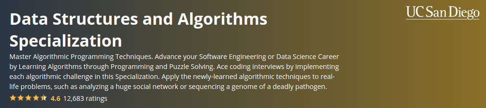

# Data Structures and Algorithms Specialization - Coursera

Applying algorithmic techniques (greedy algorithms, binary search, dynamic programming, etc.) and data structures (stacks, queues, trees, graphs, etc.) to solve more than 100 programming challenges in Python, C++ and Rust.

## Courses
1. [**Algorithmic Toolbox**](./course1-algorithmic-toolbox/)